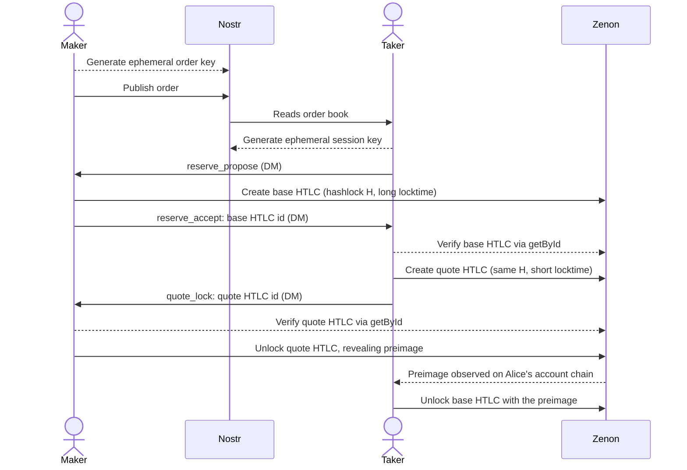

# zwap.fun

zwap.fun is a decentralized exchange for Zenon Network of Momentum assets
(ZNN, QSR and any ZTS token). Orders are public Nostr events, coordination is
private Nostr DMs, and settlement is atomic through Zenon's native HTLC
embedded contract. No custodian, no additional settlement party.

It is a fork of [granola](https://github.com/brenorb/granola) with the Cashu
ecash settlement layer replaced by Zenon HTLCs. Design:
`docs/superpowers/specs/2026-08-28-zwap-zenon-dex-design.md`.

> **Status:** proof of concept on Zenon mainnet with small amounts. Real funds.

## Protocol flow

One hash links both HTLC legs. The maker locks the base leg first (long
locktime); the taker verifies it on chain and locks the quote leg (short
locktime); the maker's `Unlock` of the quote leg reveals the preimage on
chain; the taker reads it from the chain and unlocks the base leg. Nostr is
the rendezvous and coordination layer, not a settlement ledger — the Zenon
node is authoritative for whether either leg actually moved.



See [ADR 0006](docs/adr/0006-zenon-htlc-settlement.md) for the exact
verification, observation, and refund rules, including the trust boundary
around the connected Zenon node.

## Running the wallet

```bash
npm ci
npm test
npm run dev
```

Open `http://localhost:5173/`. One page supports both sides of the exchange:
publishing an order creates an ephemeral maker role for that order, while
taking an order creates an ephemeral taker session. The same connected
wallet can hold both roles concurrently without a reload. zwap holds no
key itself — see [Wallet](#wallet) below.

By default the wallet targets **Zenon mainnet** — `.env.example` documents
the mainnet configuration. The public testnet (chain `73404`) has no faucet
yet; run against it with `npx vite --mode testnet`, which loads
`.env.testnet` over the defaults.

Follow the [manual swap walkthrough](docs/guides/manual-swap.md) to reproduce
a demonstrated swap end to end, including a refund drill. The
[agent API](docs/guides/agent-api.md) documents `window.zwap`'s exact
methods and amounts.

`npm test` runs 60 files of unit and fake-node integration tests; it never
touches a real node. A separate, real-funds
[gated live-chain integration test](docs/guides/live-test.md)
(`src/zenon/live.integration.test.ts`) is skipped unless `ZENON_INTEGRATION=1`
is set — see that guide for how to fund two throwaway seeds and run it.

### Wallet

zwap signs every Zenon account block through a browser-extension wallet —
it holds no key of its own. Discovery and signing follow
[`docs/proposals/zenon-injected-provider.md`](docs/proposals/zenon-injected-provider.md):
EIP-6963-style discovery, an
[EIP-1193](https://eips.ethereum.org/EIPS/eip-1193)-style `request()`, and a
single `zenon_sendBlock` method that takes zwap's own `ZenonTemplate` union as
its wire schema, implemented on the page side in
`src/zenon/injected-signer.ts`. With a conforming extension present (for
example [NoM Wallet](https://github.com/0x3639/nom-wallet)), the masthead
offers **Connect wallet**; with none detected, it offers to install one. See
[the wallet guide](docs/guides/wallet.md) for the connect/disconnect flow and
its known browser-keying limitation.

Production builds use `npm run build` and write the static site to `dist/`.

## What the protocol treats as authoritative

- Public Nostr events advertise orders and support rendezvous; they never
  contain preimages, private keys, or other spendable bearer material.
- Private Nostr messages bind the reservation, settlement terms, chain id,
  HTLC ids, token standards, amounts, expiry, and transcript so a message
  cannot be replayed in another session.
- The connected Zenon node decides whether each leg was created, unlocked, or
  reclaimed. A claimed HTLC's `Unlock` block is what supplies the shared
  preimage the counterparty needs to claim the other leg — never a private
  message claiming it happened.
- Fresh per-reservation Nostr session keys and a bounded timeout/refund path
  contain peer disconnects and node outages.

Atomic settlement still depends on the Zenon node you connect to honestly and
completely reporting chain state — see the
[security invariants](docs/protocol/security-invariants.md) and
[ADR 0006](docs/adr/0006-zenon-htlc-settlement.md) for the exact assumptions,
the trust boundary, and known limitations. ADR 0004 describes granola's
original Cashu-based design and is superseded by ADR 0006.

## Deployment

zwap is a static site with no backend. Primary deployment is
[Cloudflare Pages](docs/guides/deploy-cloudflare.md), which builds and
redeploys automatically on every push. A secondary
[Docker/Coolify path](docs/guides/deploy-docker.md) is available for
self-hosting. [`ci.yml`](.github/workflows/ci.yml) runs typecheck, tests, and
a build on every push and pull request; it does not deploy anything.

## Documentation

- [Manual swap walkthrough](docs/guides/manual-swap.md)
- [Browser agent API](docs/guides/agent-api.md)
- [Wallet notes](docs/guides/wallet.md)
- [Deploy to Cloudflare Pages](docs/guides/deploy-cloudflare.md)
- [Deploy with Docker](docs/guides/deploy-docker.md)
- [Full documentation index](docs/README.md)
